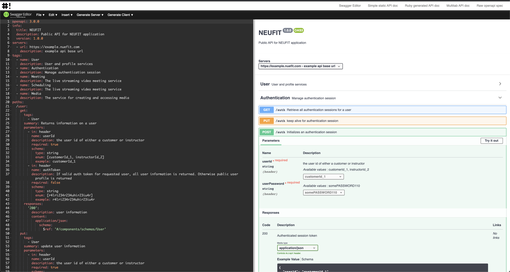
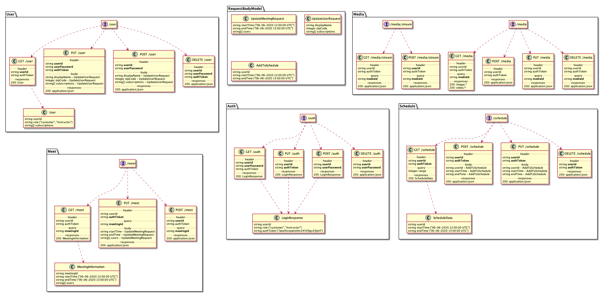
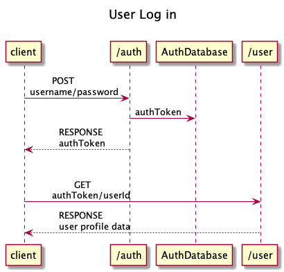
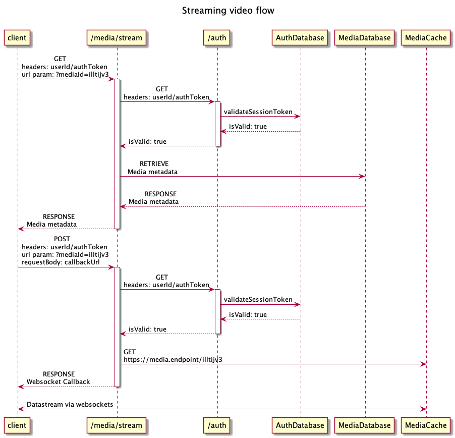

# Designing NEUFIT

- Author: Joshua Smith
- Due: April 24th
- Class: Scalable Distributed Systems

A design document for the creation of an on demand fitness streaming service offering One on one coaching, group classes, community, and multimedia offerings.

Similar products: Competitors include Peleton Digital (Group classes), Trainiac (on demand workouts and instruction), and GymGo (One on one personal coaching). Similar products range from videoconferencing products like Zoom, to educational platforms like Treehouse.

## What is NEUFIT

NEUFIT is a novel intersection of social workouts, personalized expert coaching, on demand workouts, fitness education, and instructional media (images, video, and text). NEUFIT is a fully remote fitness platform offering catered fitness solutions that goes beyond prerecorded workout videos.

## Requirements and goals of the system

Functional requirements

- Customers and Instructors can use their camera and microphone at their discretion
- Customers can subscribe to topics and/or instructors
- Customers can browse offered media
- Customers can schedule one on one sessions with instructors in the web application
- Customers can attend streaming group classes
- Customers can share their webcam feed with group classes and personal instructors
- Customers can report and block Instructors or other Customers
- Instructors are able to upload media
- Instructors can archive media that they created, preventing it from being accessed but not deleting it right away
- When an Instructor uploads media, any Customers subscribed to them will see it in their feed when they log in
- Instructors can manage their schedule by setting availability, responding to one on one consultation requests, and canceling or rescheduling appointments
- Instructors can create group fitness class schedules, which are then automatically added to their schedule

Non functional requirements

- The system should be highly available
- The system should downgrade resolution before dropping framerates or audio
- The system should be highly reliable, no uploaded media should be lost and no group fitness class should fail to stream in real time
- Users should have as close to an in person class experience as possible
- All use of cameras and microphones must be in the immediate control of the user (they should never need to dig through a menu to turn off a camera, it should always be on top)

## Capacity Estimation and Constraints

Assumptions:

- 25K total customers
- 3K total instructors
- 8.5K daily active customers
  - 80% (20K) of enrolled members use the application on a regular basis
  - Most customers use the platform three times a week (60K weekly logins)
  - 70% of daily customers (14K) use the platform from 7am-8am or 5:30pm to 6:30pm local time
  - Peak traffic is ~7500 customers and ~1K instructors
- Customers and instructors can access the platform from any geographic location at any time
- Customers can attend group classes happening in other countries, for instance if a customer logs in at 3am local time and the only active classes are a -6 hour offset the customer could join the class happening at 9pm (local to the instructor)

## System APIs

All services are provided through microservice REST APIs, however the streaming exchange for both the media service and the meeting service provides a callback and callback url to utilize websockets

Services:

- /user provides user management for both Customers and Instructors
  - GET: returns a user profile based on a userId passed in the request header. If authentication credentials are passed the full user profile is returned, else only the user's public profile is returned
  - PUT: updates to an existing user profile. Authentication credentials are required
  - POST: creates a new user by passing a userId and password
  - DELETE: deletes a user's profile from being accessed. Authentication credentials (userId, authToken, and password) are required
- /auth
  - GET: retrieve the session information by passing the authToken
  - PUT: update an existing session, intended to extend a session's timeout if the user is still doing stuff
  - POST: create a new session using a username and password, returning the authToken (also known as logging in)
  - DELETE: end a user's auth session (also known as logging out)
- /meet
  - GET: retrieve the information for a meeting by the meeting id (such as start time, end time, and attendees). This also uses a callback and callback url in order to live stream video in, and send streaming video. The Websockets API allows for two way communication between the browser and server
  - PUT: update meeting information such as extending the end time, changing the start time, or adding a user to the attendees list
  - POST: Create a new meeting. User authentication, start time, and end time are required
  - DELETE: remove a meeting event
- /schedule
  - GET: Get a user's schedule information, used for populating a calendar UI
  - PUT: Update a user's scheduled event. Requires authentication information in headers
  - POST: Create a new event. Authentication information, start time, and end time are required
  - DELETE: Delete a users scheduled event. Requires authentication
- /media
  - GET: Retrieve a piece of media by mediaId. Can return an image file or video file (to download)
  - PUT: Update an existing media item
  - POST: Create a new media object
  - DELETE: Stop a media object from being accessible
- /media/stream
  - GET: retrieve information such as metadata or thumbnail mediaIds for a stream
  - POST: create a new streaming session with the server, and exchange a callback function and callback url to establish a websocket connection (to stream video that is not live)

## Detailed API Specification

An initial draft of the api specification for this project was created in yaml following the OpenAPI 3.0 specification. It goes into greater detail what the API looks like, and I made a documentation site for it if you'd like to view it.

The yaml file is about 20 pages of text if dropped into a PDF so I'm not including it in this document. Instead I made a simple web app to host the API spec

To view the interactive specification go to https://joshuawordsmith.github.io/neufit-design/#editor

If you are unfamiliar with the OpenAPI spec you can change the contents of the left window to see how they change the interface. Expand the dropdowns and schemas to see the request/response details

I included a couple different documentation formats on there, but the raw yaml file can be found at https://joshuawordsmith.github.io/neufit-design/docs/swagger.yaml

There are other presentations of the api spec available in the other navigation menu links

**NOTE:** this site was created quickly and I only tried it with Chrome on macOS Mojave. I have no idea if the editor works on other browsers, and because most of the content is generated, I can't speak to if it is WCAG compliant

## High level design

At a high-level we would need the following components:

1. Processing Queue:​ Each uploaded video will be pushed to a processing queue to be de-queued later for encoding, thumbnail generation, and storage.
2. Encoder:​ To encode each uploaded video into multiple formats.
3. Thumbnails generator:​ To generate a few thumbnails for each video.
4. Video and Thumbnail storage:​ To store video and thumbnail files in some distributed file storage.
5. User Database:​ To store user’s information, e.g., name, email, address, etc.
6. Video metadata storage:​ A metadata database to store all the information about a video

## Example data flows

### User login flow

### Streaming video flow

## Fault tolerances

This applcation will rely on Active replication to ensure fault tolerance that can achieve faster response time than linearized replication would allow during streaming sessions. It's not a big deal if frames are dropped here or there, as long as the framerate is prioritized over resolution and the client has a steady connection.

The replication managers will permit some faults (ones that wont cascade) in order to prioritize the framerate. Since the system is distributed across n clients, and it would be reasonable to assume that clients may be changing from wifi to mobile data, or hopping between mobile towers, the replication managers will need to account for changing callback urls and websocket connections.

Since all replication managers process the same sequence of events, and have sequential consistency, we have a fault tolerant system because we dont care that much about recovering dropped data during a live stream, just that we can pick them back up as soon as possible.

## Security

The primary focus for security is on PII (personally identifying information), payments and stored payment methods, and ensuring one on one streams cannot be intercepted.

While we will secure all uploaded media, and all group classes, those use cases don't present as significant of a security risk if someone can view a group class that they would be able to attend if they had a paid membership.

Payment method storage and secure transactions will be handled by a third party. There generally just isn't a very good reason to manage credit card data and secure payment other than integrating a third party vendor that uses OAuth 2.0. Credit card transactions will be handled between the client and vendor directly, and only when a user attempts to access something that requires payment will we check their status.

For checking payment status, or checking anything that is non public from the /users service, we will be using digital signatures with private keys for each client/service exchange, in addition to creating a JWT with public encryption as an identifier for any action taken that doesn't require auth, primarily for record keeping and identifying a client without needing to log/reference actual encrypted tokens (which could present a security risk)

## Multimedia considerations

To achieve Synchronous distributed state all streaming data will go through the media/stream service (not RESTfully, it's just that the stateful streaming service is behind the /media/stream service until the stream is established) so that we can connect the users to the proper replication manager and monitor the latency between a frame being broadcast and its reception.

To achieve External synchronization (workout timer, ui updates, rep counters) we will rely on this system as well, which will require some processing of the frames in flight. It will be largely handled by the client, and the client will be diffing it's current counters with the shared global state

We want to avoid doing much video processing other than compression and encoding, becuase we want video to go from one client to another with as little interference from the server as possible.
